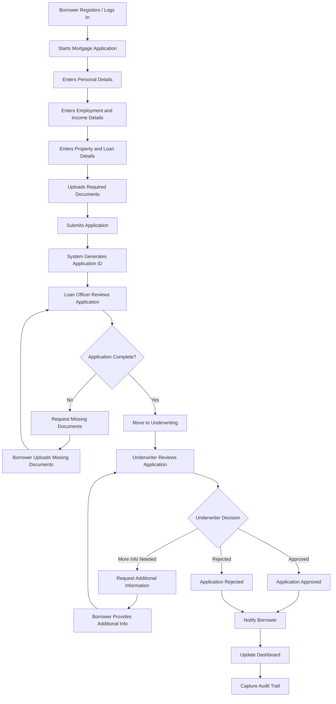
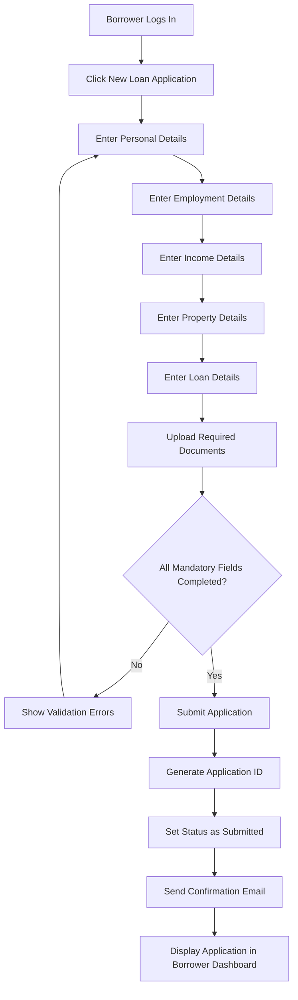
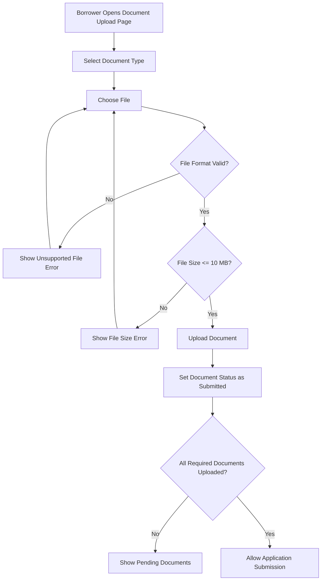
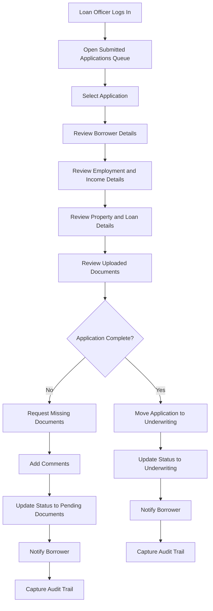
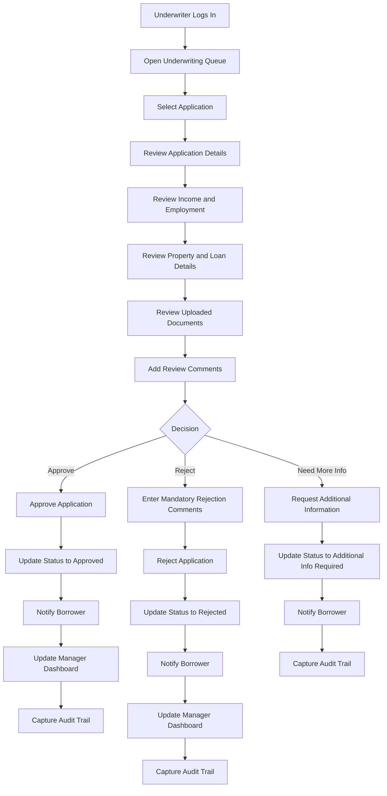
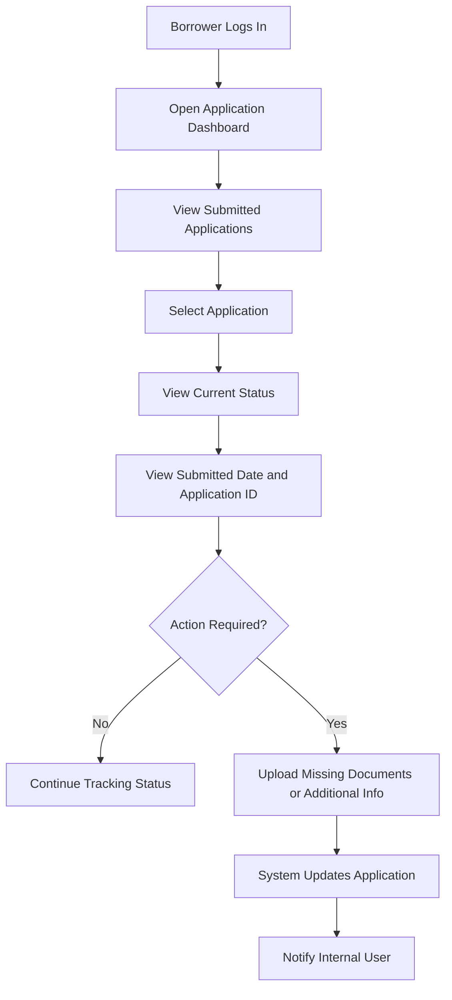
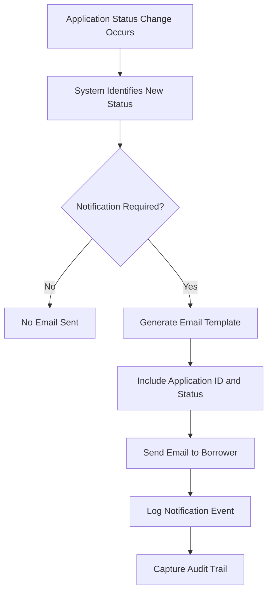
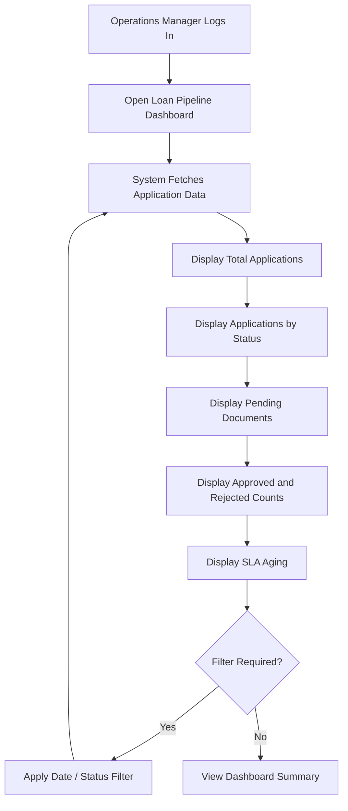
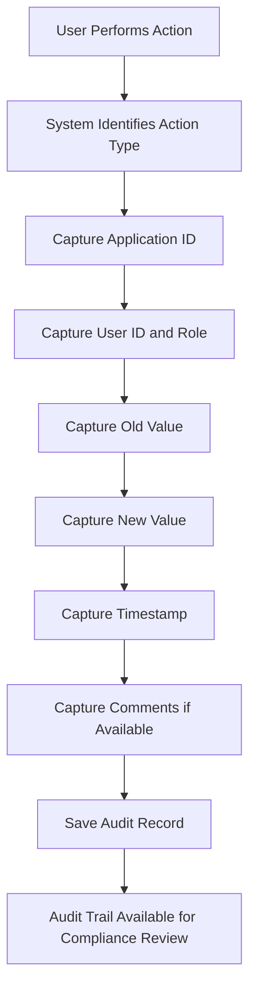

# Mortgage Loan Process Flows

## Project Name

Digital Mortgage Loan Origination & Applicant Tracking System

## Document Type

Business Process Flow Document

## Domain

Banking / Mortgage / Financial Services

---

## 1. Purpose

This document explains the major business process flows for the Mortgage Loan Origination System enhancement.

The process flows help business stakeholders, product owners, development teams, QA teams, and UAT users understand how borrowers, loan officers, underwriters, compliance users, and operations managers interact with the system.

---

## 2. High-Level End-to-End Mortgage Application Flow

---

## 3. Borrower Application Submission Flow

---

## 4. Document Upload Flow

---

## 5. Loan Officer Review Flow

---

## 6. Underwriter Decision Flow

---

## 7. Borrower Status Tracking Flow

---

## 8. Notification Flow

---

## 9. Manager Dashboard Flow

---

## 10. Audit Trail Flow

---

## 11. Key Status Transition Flow

| Current Status | Action | New Status | Performed By |
|---|---|---|---|
| Draft | Submit Application | Submitted | Borrower |
| Submitted | Start Review | In Review | Loan Officer |
| In Review | Request Missing Documents | Pending Documents | Loan Officer |
| Pending Documents | Upload Missing Documents | Submitted | Borrower |
| In Review | Move to Underwriting | Underwriting | Loan Officer |
| Underwriting | Approve Application | Approved | Underwriter |
| Underwriting | Reject Application | Rejected | Underwriter |
| Underwriting | Request More Info | Additional Info Required | Underwriter |
| Additional Info Required | Submit Additional Info | Underwriting | Borrower |
| Submitted | Withdraw Application | Withdrawn | Borrower |

---

## 12. BA Notes

As a Business Analyst, these process flows help in:

- Explaining current and future state workflows.
- Reviewing business logic with stakeholders.
- Helping developers understand expected system behavior.
- Helping QA teams design test scenarios.
- Identifying gaps in status transitions.
- Supporting UAT preparation.
- Maintaining requirement traceability.
